##  说明:

本模板来自同济大学毕业设计模板:
(https://github.com/TJ-CSCCG/tongji-undergrad-thesis-typst)
，感谢林老师的无私奉献。

本模板在同济大学毕业设计模板的基础上进行了部分修改和完善，适用于更多的毕业设计和论文写作需求。

##  使用方法(无需下载 typst)
### vscode 下载插件 TinymistTypst 

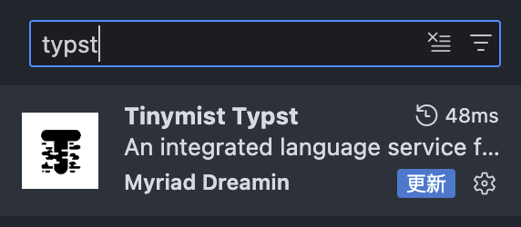

### 下载特定版本

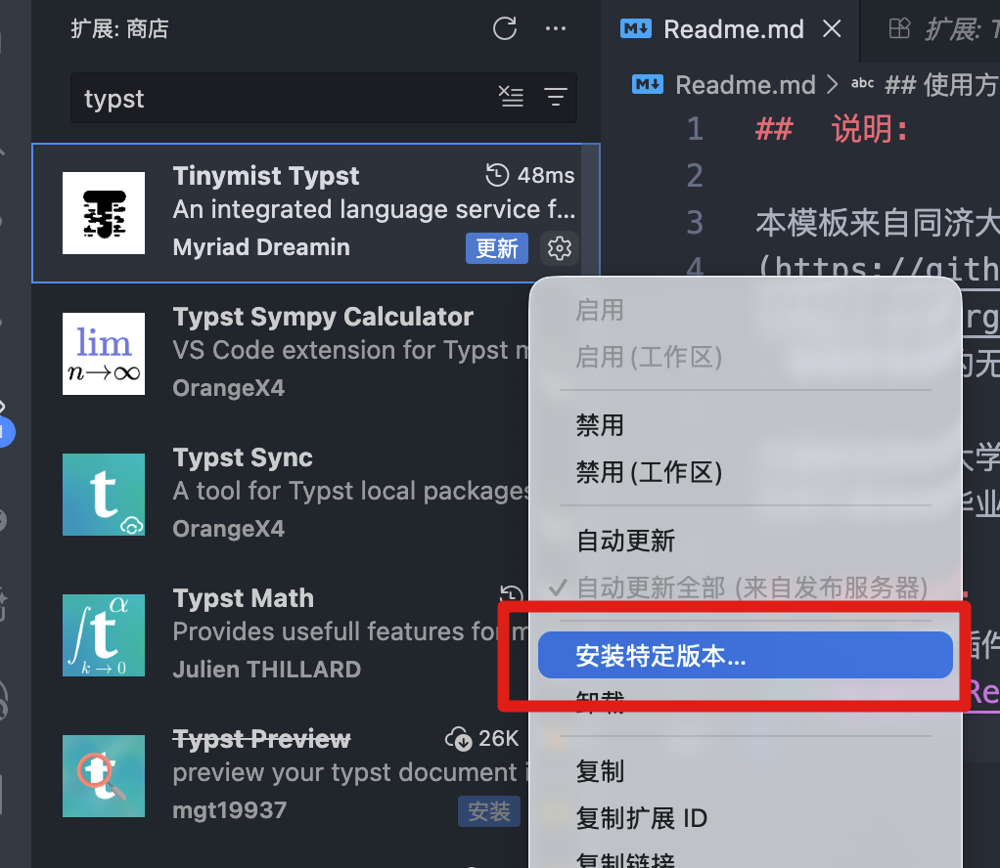
### 选择 0.12.4

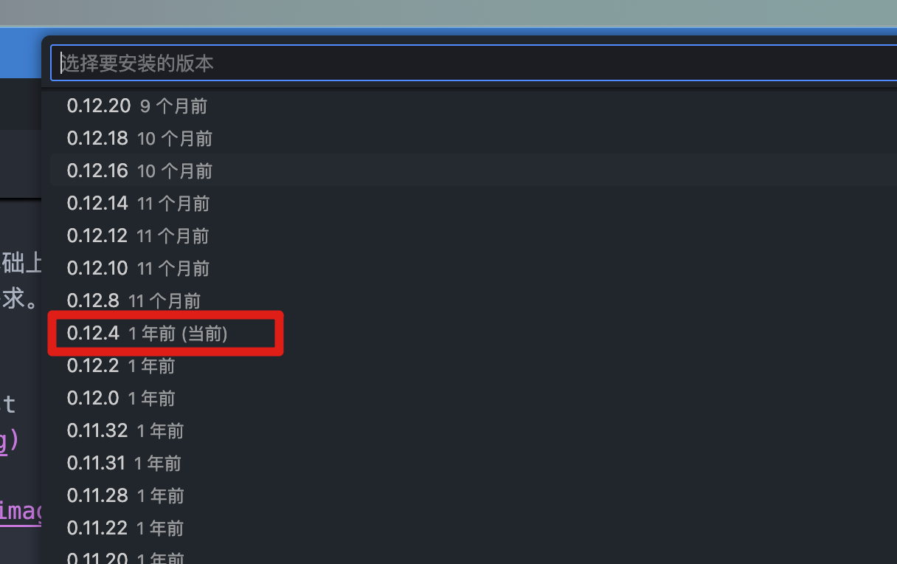

### 即可使用!

## 如何同时使用本模板
### 打开 init-files / main.typ
### Ctrl + K + V 即可预览

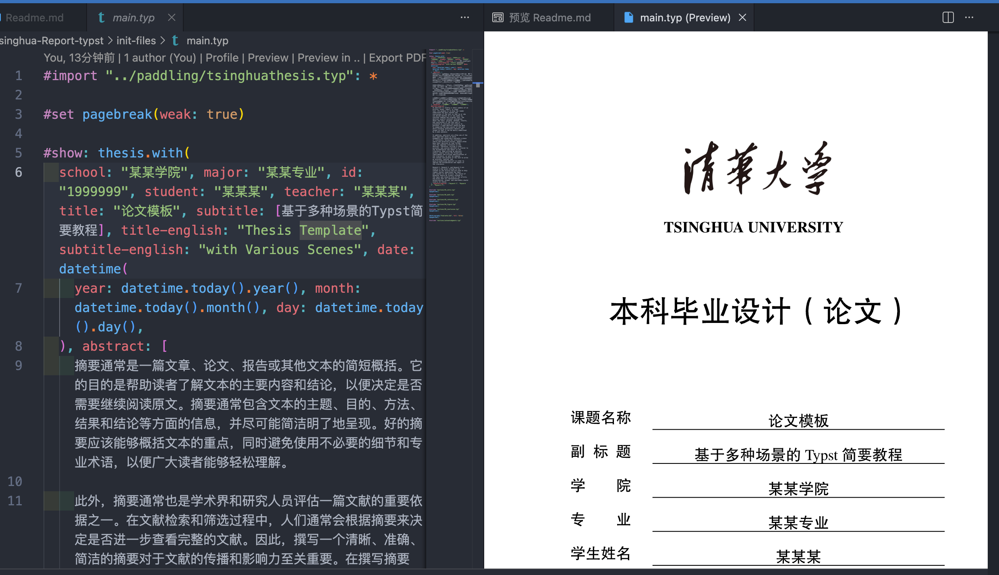

### 导出 pdf
### 打开 init-files / main.typ
### 点击上方小按钮
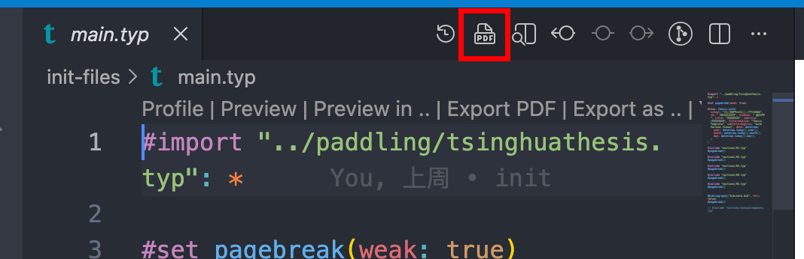

## typst 语法和使用说明, 可看原仓库或参考 llm 
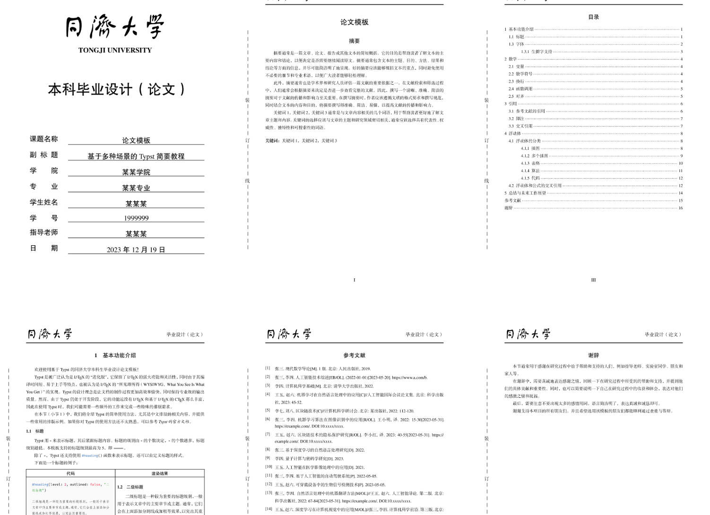

## tips 如何快速粘贴图片

### 下载 vscode 插件 paste-image
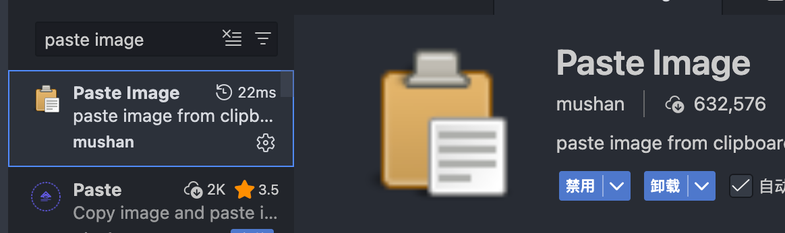

### 配置插入格式

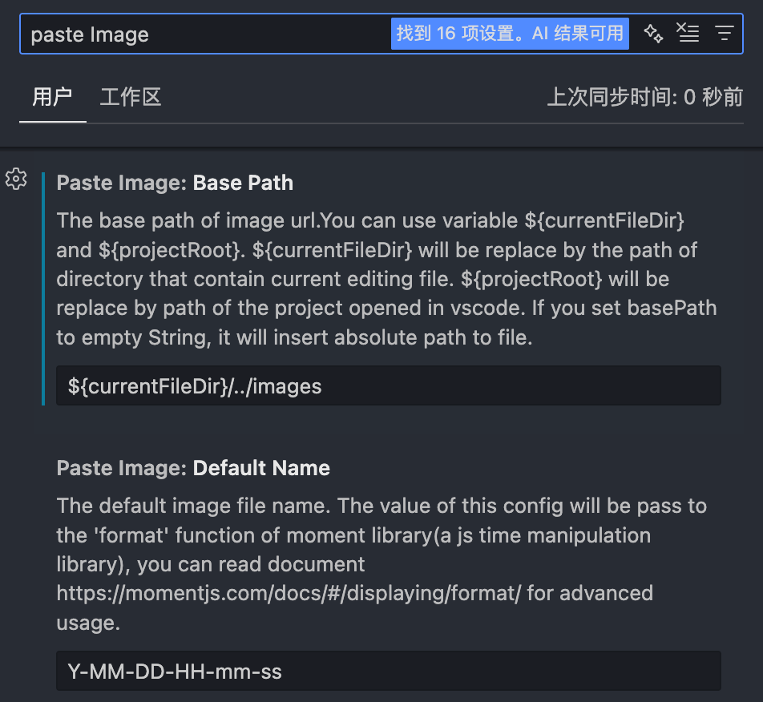
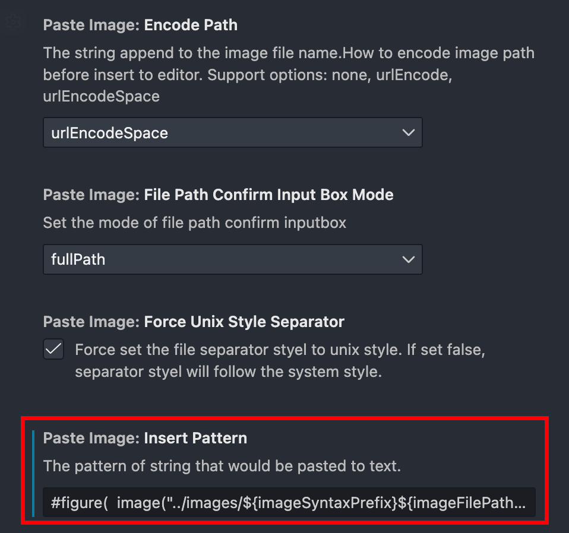

```
#figure(  image("../images/${imageSyntaxPrefix}${imageFilePath}${imageSyntaxSuffix}", width: 100%),  caption: "",) 
```
### 设置快捷键

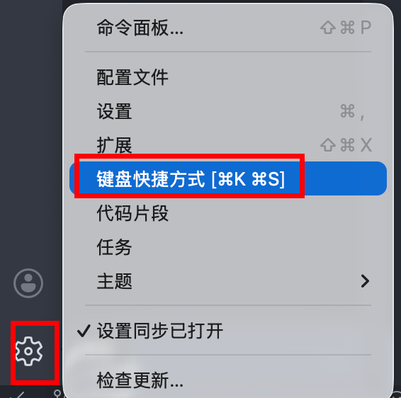

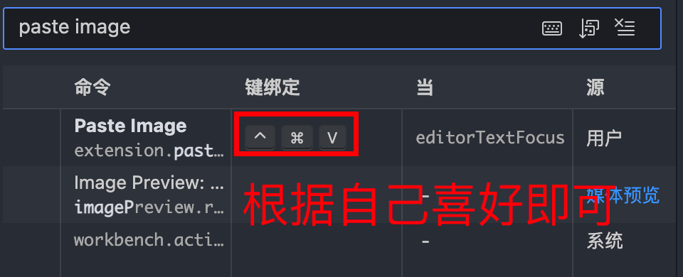